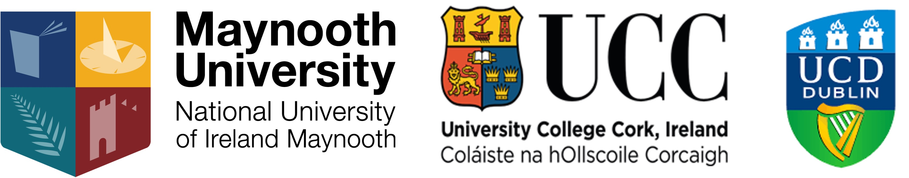

---
# an about page to describe the group About RAISE 
title: About RAISE
---
The ***Research, Application, and Inclusion in STEM Education*** **(RAISE)** research group was formed by a group of academics working in a variety of areas of STEM education across several higher education institutions (HEIs) in Ireland. The group has a core emphasis on conducting research and promoting inclusion in the broad area of STEM education both within Ireland and internationally. Initially, the group provided a means of collaboration for members beyond the borders of individual academic institutions and we maintain a strong culture of collaboration and support amongst members. 

The group conducts research across all levels of STEM education, within singular disciplines of STEM or in interdisciplinary conceptions. Group members conduct research across a variety of areas such as:

- Mathematics education 
- Technology & engineering education 
- Teacher education 
- Subject specific pedagogies 
- Assessment
- Lesson study
- Professional development 
- Cognition, problem solving & reasoning across STEM
- Presage variables 
- Policy and practice 
- Contemporary research methods for STEM education
- Bilingualism and performance in STEM 
- Critical theory
 

***Group structure and membership***
---

The group is structured around a core committee, steered by a Chair, that sits for a period of 3 years. Full details of the membership and committee are available in the ['Members'](../people/people.md) section of the website. The current committee's term is from **2022-2025**.

The group is privileged to have a wide network of colleagues and regularly collaborates with external institutions and industry outside of academia. Our current membership spans 3 Irish Universities that are substantive providers of teacher education as well as STEM education; Maynooth University, University College Cork, & University College Dublin. This multisite existence is one of the core strengths of RAISE and unlike traditional research groups, we are always open to considering new members and partnerships. The collaborative and supportive ethos of the group is prioritised and the fit of new potential members is considered with this in mind. If you would like to have a chat about being considered for membership, please get in touch via the [contact us](../contact/contact.md) page. 

***Collaborations***
---
As a group we are always open to new collaborations across both research and outreach activities in STEM education. Please feel free to get in touch with us should you wish to discuss any opportunities. 

---